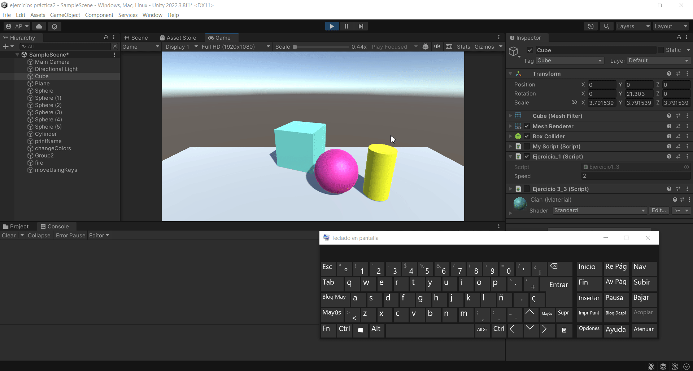
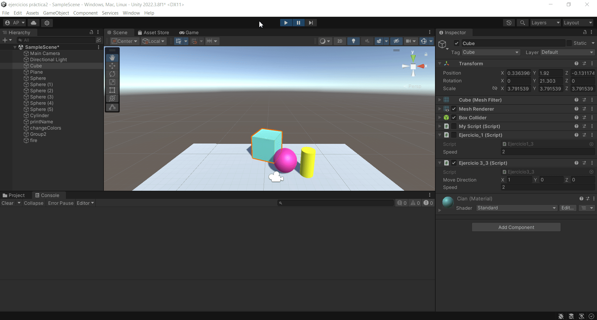
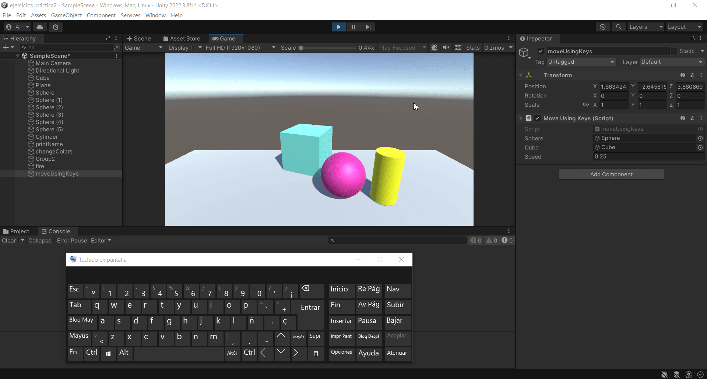
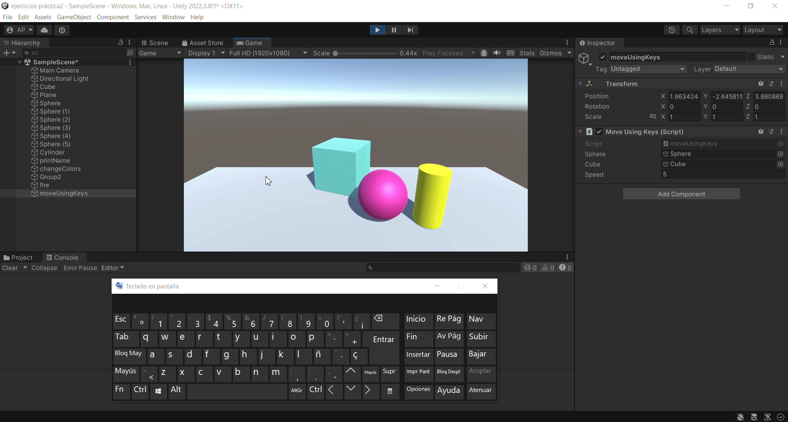
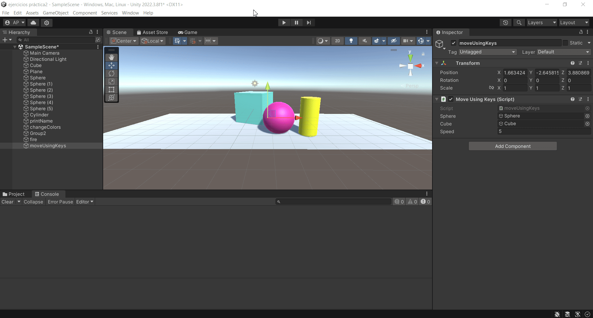

# Practica3-InterfacesInteligentes
## Movimiento - Físicas
### Alicia Guadalupe Cruz Pérez
Se han realizado varios ejercicios de movimiento en unity:

- **a) Se pide agregar un campo velocidad al cubo de la [práctica anterior](https://github.com/aliciagcp/Practica2-InterfacesInteligentes.git) y asignarle un valor que se pueda cambiar en el inspector de objetos. Mostrar en la consola el resultado de multiplicar la velocidad por el valor del eje vertical y por el valor del eje horizontal cada vez que se pulsan las teclas flecha arriba-abajo ó flecha izquierda-derecha. El mensaje debe comenzar por el nombre de la flecha pulsada.**

Para ello se han seguido los siguientes pasos:
1. Creación de un [script](scripts/ejercicio1_script.cs) asociado al cubo (Ejercicio3_1).
   
Dentro del script:
1. Declaración de una variable pública (speed) de tipo float con un valor inicial de 2f para determinar la velocidad del movimiento.
2. Obtención de la entrada horizontal (movementHorizontal) y vertical (movementVertical) del usuario usando **Input.GetAxis("Horizontal")** y **Input.GetAxis("Vertical")** respectivamente.
3. Verificación de si se presionan las teclas de flecha hacia arriba, abajo, izquierda o derecha usando **Input.GetKeyDown(KeyCode.UpArrow)**, **Input.GetKeyDown(KeyCode.DownArrow)**, **Input.GetKeyDown(KeyCode.LeftArrow)**, **Input.GetKeyDown(KeyCode.RightArrow)** respectivamente.
4. Si alguna de las teclas de flecha es presionada, se verifica cuál de ellas fue presionada utilizando **Input.GetKey(KeyCode.UpArrow)**, **Input.GetKey(KeyCode.DownArrow)**, **Input.GetKey(KeyCode.LeftArrow)**, **Input.GetKey(KeyCode.RightArrow)**.
5. Muestra de un mensaje por consola indicando la dirección correspondiente ("Flecha arriba", "Flecha abajo", "Flecha izquierda" o "Flecha derecha") junto con la velocidad del movimiento en esa dirección, que es calculada multiplicando la entrada horizontal o vertical por **speed**.

  

- **b) Mapear la tecla H a la función disparo.**

Para ello se han seguido los siguientes pasos:
1. Abrir **Input Manager** (Edit > Project Settings > Input Manager).
2. Configuración del botón de disparo "Fire1".
3. Cambio del ajuste "Positive Button" a la tecla H.
4. Creación de un [script](scripts/ejercicio2_script.cs) (check Fire Key) asociado a un objeto vacío (fire) para comprobar su correcto funcionamiento.

Dentro del script:
1. Comprobación de si la tecla "Fire1" está siendo presionada usando **Input.GetButtonDown("Fire1")**.
2. Muestra de un mensaje por consola ("Disparo!") cuando la tecla "Fire1" es presionada.

  

- **c) Se pide crear un script asociado al cubo que en cada iteración traslade al cubo una cantidad proporcional un vector que indica la dirección del movimiento: moveDirection que debe poder modificarse en el inspector. La velocidad a la que se produce el movimiento también se especifica en el inspector, con la propiedad speed. Inicialmente la velocidad debe ser mayor que 1 y el cubo estar en una posición y=0. En el informe de la práctica comenta los resultados que obtienes en cada una de las siguientes situaciones:**
   + **Duplicas las coordenadas de la dirección del movimiento.**
   + **Duplicas la velocidad manteniendo la dirección del movimiento.**
   + **La velocidad que usas es menor que 1**
   + **La posición del cubo tiene y>0**
   + **Intercambiar movimiento relativo al sistema de referencia local y el mundial.**
     

Para ello se han seguido los siguientes pasos:
1. Creación de un [script](scripts/ejercicio3_script.cs) asociado al cubo (Ejercicio3_3).
2. Cambio de la posición (eje y) del cubo en el inspector a "y=0".

Dentro del script:
1. Declaración de una variable pública (moveDirection) de tipo Vector3 con un valor inicial de (1f, 0f, 0f).
2. Declaración de una variable pública (speed) de tipo float con un valor inicial de 2f.
3. Declaración de una variable pública (referenceSpace) de tipo Space con un valor inicial de **Space.Self**.
3. Multiplicación de **moveDirection** por **speed** y por **Time.deltaTime** para calcular el desplazamiento en el marco de tiempo actual.
4. Uso de **transform.Translate(displacement)** para mover el objeto al que está adjunto el script en la dirección especificada por **moveDirection** con la velocidad especificada por **speed** y ajustado por el tiempo del fotograma usando **Time.deltaTime**, considerando el espacio de referencia especificado por **referenceSpace** (que puede ser Space.Self o Space.World).

Resultados obtenidos:
+ **Duplicas las coordenadas de la dirección del movimiento**: Si duplicas las coordenadas de *moveDirection*, el cubo se moverá en una dirección diferente. [gif](gifs/ejercicio3_1.gif)
+ **Duplicas la velocidad manteniendo la dirección del movimiento**: Si duplicas la propiedad *speed*, el cubo se moverá más rápido en la misma dirección especificada por *moveDirection*. [gif](gifs/ejercicio3_2.gif)
+ **La velocidad que usas es menor que 1**: Si la velocidad es menor que 1, el cubo se moverá más lentamente. [gif](gifs/ejercicio3_3.gif)
+ **La posición del cubo tiene y>0**: Si cambias la posición del cubo en el eje Y a un valor mayor que 0, el cubo se moverá en esa dirección además de la dirección especificada por moveDirection. [gif](gifs/ejercicio3_4.gif)
+ **Intercambiar movimiento relativo al sistema de referencia local y el mundial**: Al usar *Space.Self* el objeto se moverá en la dirección especificada (moveDirection) relativa a su propia orientación, ignorando la orientación global del mundo. Sin embargo, al usar *Space.World* el objeto se moverá en función de la orientación global del mundo, ignorando su propia orientación local. [gif](gifs/ejercicio3_5.gif)

  

- **d) Se pide mover el cubo con las teclas de flecha arriba-abajo, izquierda-derecha a la velocidad speed. Cada uno de estos ejes implican desplazamientos en el eje vertical y horizontal respectivamente. Mover la esfera con las teclas w-s (movimiento vertical) a-d (movimiento horizontal).**
     

Para ello se han seguido los siguientes pasos:
1. Creación de un [script](scripts/ejercicio4_script.cs) asociado a un objeto vacío (moveUsingKeys).
2. Abrir **Input Manager** (Edit > Project Settings > Input Manager).
3. Creación y configuración de los botones "VerticalCube" y "HorizontalCube".
4. Cambio del ajuste "Positive Button" y "Negative Button" a las teclas ("up", "down", "left" y "right") según corresponda.
5. Creación y configuración de los botones "VerticalSphere" y "HorizontalSphere".
6. Cambio del ajuste "Positive Button" y "Negative Button" a las teclas ("w", "s", "a" y "w") según corresponda.
7. Asignación de los objetos "Cube" y "Sphere" en el inspector del objeto que contiene dicho script.

Dentro del script:
1. Declaración de variables públicas (sphere y cube) de tipo GameObject para referenciar los objetos de esfera y cubo respectivamente.
2. Declaración de una variable pública (speed) de tipo float con un valor inicial de 0.25f para determinar la velocidad del movimiento.
3. Obtención del input vertical (moveVerticalCube) y horizontal (moveHorizontalCube) para el objeto **cube** usando los ejes "VerticalCube" y "HorizontalCube".
4. Creación de un vector de movimiento (movementCube) para el cubo utilizando los valores de **input vertical** y **horizontal** multiplicados por **speed**. (new Vector3(moveHorizontalCube, 0f, moveVerticalCube) * speed)
5. Movimiento del objeto **cube** usando **cube.transform.Translate(movementCube)** para aplicar la translación según el vector de movimiento calculado.
6. Obtención del input vertical (moveVerticalSphere) y horizontal (moveHorizontalSphere) para el objeto **sphere** usando los ejes "VerticalSphere" y "HorizontalSphere".
7. Creación de un vector de movimiento (movementSphere) para la sphere utilizando los valores de **input vertical** y **horizontal** multiplicados por **speed**. (new Vector3(moveHorizontalSphere, 0f, moveVerticalSphere) * speed)
8. Movimiento del objeto **sphere** usando **sphere.transform.Translate(movementSphere)** para aplicar la translación según el vector de movimiento calculado.

  

- **e) Se pide adaptar el movimiento en el ejercicio 4 para que sea proporcional al tiempo transcurrido durante la generación del frame.**
     

Para ello se han seguido los siguientes pasos:
1. Edición del anterior [script](scripts/ejercicio5_script.cs) (moveUsingKeys).

Cambios dentro del script:
1. Multiplicación del vector de movimiento por **Time.deltaTime**. (new Vector3(moveHorizontalCube, 0f, moveVerticalCube) * speed * Time.deltaTime;) y (new Vector3(moveHorizontalSphere, 0f, moveVerticalSphere) * speed * Time.deltaTime)

  

- **f) Se pide adaptar el movimiento en el ejercicio 5 para que el cubo se mueva hacia la posición de la esfera. Debes considerar, que el avance no debe estar influenciado por cuánto de lejos o cerca estén los dos objetos.**
     

Para ello se han seguido los siguientes pasos:
1. Edición del anterior [script](scripts/ejercicio6_script.cs) (moveUsingKeys).

Cambios dentro del script:
1. Cálculo de la dirección hacia la esfera (directionToSphere) restando la posición de la esfera de la posición del cubo (Vector3 directionToSphere = sphere.transform.position - cube.transform.position;).
2. Normalización de la dirección calculada (normalizedDirection) para obtener un vector de dirección unitario (Vector3 normalizedDirection = directionToSphere.normalized;).
3. Cálculo del vector de movimiento para el cubo (movementCube) multiplicando la dirección normalizada por **speed** y por **Time.deltaTime**. (Vector3 movementCube = normalizedDirection * speed * Time.deltaTime;)
4. Movimiento del objeto **cube** usando **cube.transform.Translate(movementCube)** para aplicar la translación según el vector de movimiento calculado.

  

- **g) Se pide adaptar el movimiento en el ejercicio 6 de forma que el cubo gire hacia la esfera. Realizar pruebas cambiando la posición de la esfera mediante las teclas awsd.**
     

Para ello se han seguido los siguientes pasos:
1. Edición del anterior [script](scripts/ejercicio7_script.cs) (moveUsingKeys).

Cambios dentro del script:
1. Cálculo de la dirección hacia la esfera (directionToSphere) restando la posición de la esfera de la posición del cubo. (Vector3 directionToSphere = sphere.transform.position - cube.transform.position;).
2. Orientación del cubo hacia la esfera utilizando **cube.transform.LookAt(sphere.transform, Vector3.up);**. Esto hace que el cubo mire hacia la posición de la esfera mientras mantiene su orientación vertical utilizando **Vector3.up** como el eje hacia arriba.
3. Cálculo del vector de movimiento (movement) para el cubo multiplicando el vector de avance (cube.transform.forward) por **speed** y por **Time.deltaTime**. (Vector3 movement = cube.transform.forward * speed * Time.deltaTime;).
4. Movimiento del objeto cube en la dirección hacia la esfera utilizando **cube.transform.Translate(movement, Space.World);**, donde **Space.World** indica que el movimiento se realiza en el espacio mundial, independientemente de la rotación del objeto.

