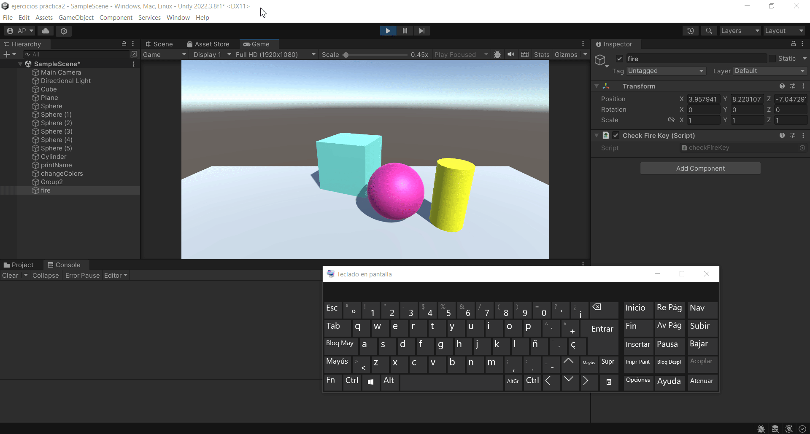

# Practica3-InterfacesInteligentes
## Movimiento - Físicas
### Alicia Guadalupe Cruz Pérez
Se han realizado varios ejercicios de script en unity:

- **a) Se pide agregar un campo velocidad al cubo de la [práctica anterior](https://github.com/aliciagcp/Practica2-InterfacesInteligentes.git) y asignarle un valor que se pueda cambiar en el inspector de objetos. Mostrar en la consola el resultado de multiplicar la velocidad por el valor del eje vertical y por el valor del eje horizontal cada vez que se pulsan las teclas flecha arriba-abajo ó flecha izquierda-derecha. El mensaje debe comenzar por el nombre de la flecha pulsada.**

Para ello se han seguido los siguientes pasos:
1. Creación de un [script](scripts/ejercicio1_script.cs) asociado al cubo (Ejercicio_1).
   
Dentro del script:
1. Declaración de una variable pública de tipo float (speed) con un valor predeterminado de 2f.
2. Verificación de las teclas de flecha hacia arriba y hacia abajo usando **Input.GetKeyDown(KeyCode.UpArrow)** e **Input.GetKeyDown(KeyCode.DownArrow)**.
3. Obtención de la entrada vertical del eje usando **Input.GetAxis("Vertical")** y creación de un vector de movimiento en el eje X con la velocidad multiplicada por la entrada vertical (new Vector3(verticalInput * speed, 0, 0)).
4. Muestra de mensajes por consola indicando el nombre de la flecha presionada ("up" o "down") y la velocidad en el eje X cuando se presionan las teclas de flecha hacia arriba o hacia abajo.
5. Verificación de las teclas de flecha izquierda y derecha usando **Input.GetKeyDown(KeyCode.LeftArrow)** e **Input.GetKeyDown(KeyCode.RightArrow)**.
6. Obtención de la entrada horizontal del eje usando **Input.GetAxis("Horizontal")** y creación de un vector de movimiento en el eje X con la velocidad multiplicada por la entrada horizontal (new Vector3(horizontalInput * speed, 0, 0)).
7. Muestra de mensajes por consola indicando el nombre de la flecha presionada ("left" o "right") y la velocidad en el eje X cuando se presionan las teclas de flecha hacia la izquierda o hacia la derecha.

  

- **b) Mapear la tecla H a la función disparo.**

Para ello se han seguido los siguientes pasos:
1. Abrir **Input Manager** (Edit > Project Settings > Input Manager).
2. Configuración del botón de disparo "Fire1".
3. Cambio del ajuste "Positive Button" a la tecla H.
4. Creación de un [script](scripts/ejercicio2_script.cs) (check Fire Key) asociado a un objeto vacío (fire) para comprobar su correcto funcionamiento.

Dentro del script:
1. Comprobación de si la tecla "Fire1" está siendo presionada usando **Input.GetButtonDown("Fire1")**.
2. Muestra de un mensaje por consola ("Disparo!") cuando la tecla "Fire1" es presionada.

  

- **c) Se pide crear un script asociado al cubo que en cada iteración traslade al cubo una cantidad proporcional un vector que indica la dirección del movimiento: moveDirection que debe poder modificarse en el inspector. La velocidad a la que se produce el movimiento también se especifica en el inspector, con la propiedad speed. Inicialmente la velocidad debe ser mayor que 1 y el cubo estar en una posición y=0. En el informe de la práctica comenta los resultados que obtienes en cada una de las siguientes situaciones:**
   + **Duplicas las coordenadas de la dirección del movimiento.**
   + **Duplicas la velocidad manteniendo la dirección del movimiento.**
   + **La velocidad que usas es menor que 1**
   + **La posición del cubo tiene y>0**
   + **Intercambiar movimiento relativo al sistema de referencia local y el mundial.**
     

Para ello se han seguido los siguientes pasos:
1. Creación de un [script](scripts/ejercicio3_script.cs) asociado al cubo (Ejercicio3_3).
2. Cambio de la posición (eje y) del cubo en el inspector a "y=0".

Dentro del script:
1. Declaración de una variable pública (moveDirection) de tipo Vector3 con un valor inicial de (1f, 0f, 0f).
2. Declaración de una variable pública (speed) de tipo float con un valor inicial de 2f.
3. Declaración de una variable pública (referenceSpace) de tipo Space con un valor inicial de **Space.Self**.
3. Multiplicación de **moveDirection** por **speed** y por **Time.deltaTime** para calcular el desplazamiento en el marco de tiempo actual.
4. Uso de **transform.Translate(displacement)** para mover el objeto al que está adjunto el script en la dirección especificada por **moveDirection** con la velocidad especificada por **speed** y ajustado por el tiempo del fotograma usando **Time.deltaTime**, considerando el espacio de referencia especificado por **referenceSpace** (que puede ser Space.Self o Space.World).

Resultados obtenidos:
+ **Duplicas las coordenadas de la dirección del movimiento**: Si duplicas las coordenadas de *moveDirection*, el cubo se moverá en una dirección diferente. [gif](gifs/ejercicio3_1.gif)
+ **Duplicas la velocidad manteniendo la dirección del movimiento**: Si duplicas la propiedad *speed*, el cubo se moverá más rápido en la misma dirección especificada por moveDirection. [gif](gifs/ejercicio3_2.gif)
+ **La velocidad que usas es menor que 1**: Si la velocidad es menor que 1, el cubo se moverá más lentamente. [gif](gifs/ejercicio3_3.gif)
+ **La posición del cubo tiene y>0**: Si cambias la posición del cubo en el eje Y a un valor mayor que 0, el cubo se moverá en esa dirección además de la dirección especificada por moveDirection. [gif](gifs/ejercicio3_4.gif)
+ **Intercambiar movimiento relativo al sistema de referencia local y el mundial**: Al usar *Space.Self* el objeto se moverá en la dirección especificada (moveDirection) relativa a su propia orientación, ignorando la orientación global del mundo. Sin embargo, al usar *Space.World* el objeto se moverá en función de la orientación global del mundo, ignorando su propia orientación local. [gif](gifs/ejercicio3_5.gif)

