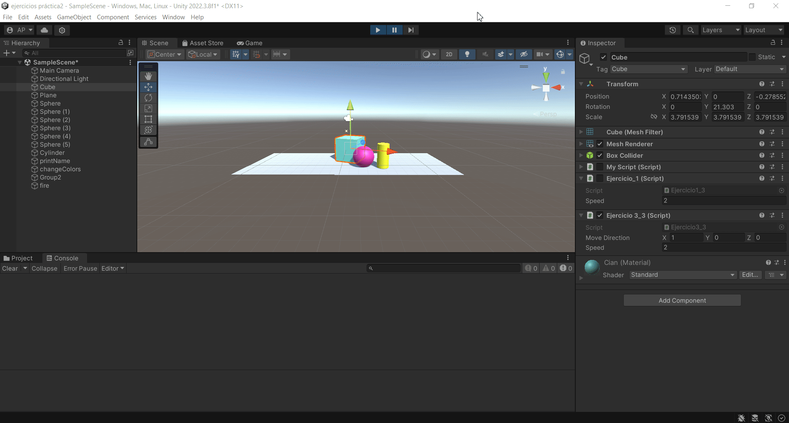

# Practica3-InterfacesInteligentes
## Movimiento - Físicas
### Alicia Guadalupe Cruz Pérez
Se han realizado varios ejercicios de script en unity:

- **a) Se pide agregar un campo velocidad al cubo de la [práctica anterior](https://github.com/aliciagcp/Practica2-InterfacesInteligentes.git) y asignarle un valor que se pueda cambiar en el inspector de objetos. Mostrar en la consola el resultado de multiplicar la velocidad por el valor del eje vertical y por el valor del eje horizontal cada vez que se pulsan las teclas flecha arriba-abajo ó flecha izquierda-derecha. El mensaje debe comenzar por el nombre de la flecha pulsada.**

Para ello se han seguido los siguientes pasos:
1. Creación de un [script](scripts/ejercicio1_script.cs) asociado al cubo (Ejercicio_1).
   
Dentro del script:
1. Declaración de una variable pública de tipo float (speed) con un valor predeterminado de 2f.
2. Verificación de las teclas de flecha hacia arriba y hacia abajo usando **Input.GetKeyDown(KeyCode.UpArrow)** e **Input.GetKeyDown(KeyCode.DownArrow)**.
3. Obtención de la entrada vertical del eje usando **Input.GetAxis("Vertical")** y creación de un vector de movimiento en el eje X con la velocidad multiplicada por la entrada vertical (new Vector3(verticalInput * speed, 0, 0)).
4. Muestra de mensajes por consola indicando el nombre de la flecha presionada ("up" o "down") y la velocidad en el eje X cuando se presionan las teclas de flecha hacia arriba o hacia abajo.
5. Verificación de las teclas de flecha izquierda y derecha usando **Input.GetKeyDown(KeyCode.LeftArrow)** e **Input.GetKeyDown(KeyCode.RightArrow)**.
6. Obtención de la entrada horizontal del eje usando **Input.GetAxis("Horizontal")** y creación de un vector de movimiento en el eje X con la velocidad multiplicada por la entrada horizontal (new Vector3(horizontalInput * speed, 0, 0)).
7. Muestra de mensajes por consola indicando el nombre de la flecha presionada ("left" o "right") y la velocidad en el eje X cuando se presionan las teclas de flecha hacia la izquierda o hacia la derecha.

  

- **b) Mapear la tecla H a la función disparo.**

Para ello se han seguido los siguientes pasos:
1. Abrir **Input Manager** (Edit > Project Settings > Input Manager).
2. Configuración del botón de disparo "Fire1".
3. Cambio del ajuste "Positive Button" a la tecla H.
4. Creación de un [script](scripts/ejercicio2_script.cs) (check Fire Key) asociado a un objeto vacío (fire) para comprobar su correcto funcionamiento.

Dentro del script:
1. Comprobación de si la tecla "Fire1" está siendo presionada usando **Input.GetButtonDown("Fire1")**.
2. Muestra de un mensaje por consola ("Disparo!") cuando la tecla "Fire1" es presionada.

  

- **c) Se pide crear un script asociado al cubo que en cada iteración traslade al cubo una cantidad proporcional un vector que indica la dirección del movimiento: moveDirection que debe poder modificarse en el inspector. La velocidad a la que se produce el movimiento también se especifica en el inspector, con la propiedad speed. Inicialmente la velocidad debe ser mayor que 1 y el cubo estar en una posición y=0. En el informe de la práctica comenta los resultados que obtienes en cada una de las siguientes situaciones:**
   + **duplicas las coordenadas de la dirección del movimiento.**
   + **duplicas la velocidad manteniendo la dirección del movimiento.**
   + **la velocidad que usas es menor que 1**
   + **la posición del cubo tiene y>0**
   + **intercambiar movimiento relativo al sistema de referencia local y el mundial.**

Para ello se han seguido los siguientes pasos:
1. Abrir **Input Manager** (Edit > Project Settings > Input Manager).
2. Configuración del botón de disparo "Fire1".
3. Cambio del ajuste "Positive Button" a la tecla H.
4. Creación de un [script](scripts/ejercicio3_script.cs) (check Fire Key) asociado a un objeto vacío (fire) para comprobar su correcto funcionamiento.

Dentro del script:
